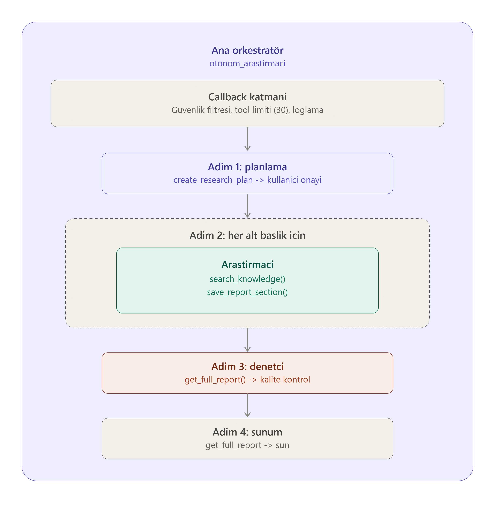

# 🧠 ARA — Autonomous Research Agent

<div align="center">

**Google ADK — Otonom Araştırma Agent'ı**

*Otonom Planlama · Sub-Agent Mimarisi · Human-in-the-Loop · Kalite Denetimi*


</div>

---

> Bu repo, **Google Agent Development Kit (ADK)** ile geliştirilmiş başarılı bir demo çalışmasıdır.
> Karmaşık olmayan, SDK'nın önemli özelliklerini (sub-agent, callback, planlama, HITL) kapsayan,
> öğretici bir referans projedir.

---

## 📖 İçindekiler

1. [Genel Bakış](#-genel-bakış)
2. [Mimari](#-mimari)
3. [Kurulum](#-kurulum)
4. [Çalıştırma](#-çalıştırma)
5. [Örnek Konular](#-örnek-araştırma-konuları)
6. [Dosya Yapısı](#-dosya-yapısı)
7. [Teknik Detay](#-teknik-detay)
8. [Öğrenme Çıktıları](#-öğrenme-çıktıları)
9. [Kaynaklar](#-kaynaklar)

---

## 🎯 Genel Bakış

**ARA (Autonomous Research Agent)**, Google ADK üzerine inşa edilmiş
bir otonom araştırma sistemidir.

Kullanıcının verdiği bir konuyu:

1. **Kendi kendine planlar** — Konuyu alt başlıklara böler, onay ister
2. **Derinlemesine araştırır** — Her alt başlık için bilgi toplar, rapora kaydeder
3. **Kalite kontrolünden geçirir** — Denetçi agent eksikleri tespit eder
4. **Sonucu kullanıcıya sunar** — Tamamlanmış Markdown rapor

---

## 🏗️ Mimari

### Agent Hiyerarşisi



```
┌─────────────────────────────────────────────────────────┐
│            ANA ORKESTRATÖR (otonom_arastirmaci)          │
│                                                         │
│  🔒 Callback Layer (before/after agent & tool)          │
│     • Güvenlik filtresi • Tool limiti (max 30)          │
│     • Detaylı loglama ve metrik toplama                 │
│                                                         │
│  ADIM 1: create_research_plan → ✋ Kullanıcı onayı      │
│                                                         │
│  ADIM 2: HER alt başlık için:                           │
│    ┌──────────────────────────┐                         │
│    │      ARAŞTIRMACI          │                         │
│    │  search_knowledge()       │                         │
│    │  save_report_section()    │  ← Araştırır VE rapora  │
│    └──────────────────────────┘     kaydeder             │
│                                                         │
│  ADIM 3: Tüm konular bitince:                           │
│    ┌──────────────────────────┐                         │
│    │       DENETÇİ             │                         │
│    │  get_full_report()        │  ← Kalite kontrol       │
│    └──────────────────────────┘                         │
│                                                         │
│  ADIM 4: get_full_report → SUN                          │
└─────────────────────────────────────────────────────────┘
```

### Agent Rolleri

| Agent | Rol | Araçlar |
|-------|-----|---------|
| `otonom_arastirmaci` | 🎯 Orkestratör | `create_research_plan`, `advance_plan_step`, `get_full_report`, `log_progress` |
| `arastirmaci` | 🔍 Araştırmacı | `search_knowledge`, `save_report_section`, `log_progress` |
| `denetci` | ✅ Denetçi | `get_full_report`, `log_progress` |

> 💡 Araştırmacı aynı zamanda rapora yazar — ayrı bir "yazar" agent'a gerek kalmaz. Bu, ADK'nın sub-agent zincirleme kısıtına karşı pragmatik bir çözümdür.

---

## 🛠️ Kurulum

```powershell
cd senior
python -m venv .venv
.\.venv\Scripts\Activate.ps1
pip install -r requirements.txt
```

`senior/.env` dosyasına Gemini API anahtarınızı yazın.

---

## ▶️ Çalıştırma

### Web Arayüzü

```powershell
adk web
```

Sol üstten **`otonom_arastirmaci`** seçin, bir konu yazın. 3 agent çalışır:
- `otonom_arastirmaci` planlar ve yönetir
- `arastirmaci` araştırır ve rapora ekler
- `denetci` kalite kontrol yapar

### İnteraktif Mod

```powershell
python run.py
```

---

## 🧪 Örnek Araştırma Konuları

| # | Konu | Ne Gözlemlenir? |
|---|------|-----------------|
| 1 | `Yapay zeka etiği` | 3-5 alt başlığa böler, araştırır, denetler |
| 2 | `Derin öğrenme ve uygulamaları` | Teknik konu → derinlemesine arama |
| 3 | `Büyük dil modellerinin geleceği` | Spekülatif konu → farklı bakış açıları |
| 4 | `Pekiştirmeli öğrenme nedir?` | Dar konu → az ama derin |
| 5 | `Python ile web geliştirme` | Bilgi tabanı dışı → farklı anahtarla tekrar dener |
| 6 | `Makine öğrenmesi vs derin öğrenme` | Karşılaştırmalı konu |

---

## 📁 Dosya Yapısı

```
senior/
├── README.md
├── requirements.txt
├── .gitignore
├── .env
├── __init__.py
├── images/
│   └── demo.gif
│
├── agent.py          ← 🎯 Ana orkestratör (root_agent)
├── tools.py          ← 🔧 7 tool: search, plan, save, review...
├── callbacks.py      ← 🔒 4 callback: before/after agent & tool
├── sub_agents.py     ← 🤖 2 uzman: arastirmaci + denetci
└── run.py            ← 🚀 İnteraktif demo
```

---

## 🔬 Teknik Detay

### 1. Callback Katmanı

```python
before_agent()   # Kullanıcı girdisi → güvenlik filtresi
after_agent()    # Oturum istatistikleri → metrik toplama
before_tool()    # Tool limiti kontrolü (max 30/oturum)
after_tool()     # Başarı/başarısızlık takibi
```

> ⚠️ ADK 2.x notu: Tool callback'leri `(BaseTool, dict, ToolContext)` imzası alır, `CallbackContext` değil.

### 2. ReAct + Plan-Execute

```
Kullanıcı: "Yapay zeka etiği"
    │
    ▼
create_research_plan() → ["Tanım", "İlkeler", "Önyargı", ...]
    │
    ▼
Her alt başlık için:
    advance_plan_step() → arastirmaci → sonraki
    │
    ▼
denetci → get_full_report → SUN
```

### 3. Human-in-the-Loop (Soft)

ADK'da HITL, instruction seviyesinde çalışır — orkestratör planı gösterir,
kullanıcı onaylayana kadar beklemez. Bu, LangGraph'teki `interrupt_before`
gibi framework seviyesinde bir mekanizma değildir.

### 4. Hata Yönetimi

```
Araştırma başarısız → farklı anahtar kelimeyle tekrar (max 2)
2 deneme başarısız → alt konuyu atla, "bilgi bulunamadı" notu düş
```

---

## 🎓 Öğrenme Çıktıları

| # | Beceri | Açıklama |
|---|--------|----------|
| 1 | **Sub-Agent Mimarisi** | İş bölümü ve uzmanlaşma |
| 2 | **Callback'ler** | Agent yaşam döngüsüne müdahale |
| 3 | **Otonom Planlama** | Agent'ın kendi iş akışını yönetmesi |
| 4 | **ReAct Deseni** | Düşün-Harekete Geç-Gözlemle |
| 5 | **Human-in-the-Loop** | Kritik kararlarda kullanıcı onayı |
| 6 | **Hata Recovery** | Başarısız adımları tekrar deneme |
| 7 | **Artifact Üretimi** | Yapılandırılmış rapor çıktısı |
| 8 | **Modüler Mimari** | tools / callbacks / sub_agents ayrı dosyalarda |
| 9 | **Monitoring** | Tool sayısı, hata, süre takibi |
| 10 | **ADK 2.x API** | Güncel callback imzaları, import yönetimi |

---

## 📖 Kaynaklar

- [ADK Dokümantasyon](https://adk.dev/)
- [ADK Callbacks](https://adk.dev/callbacks/)
- [ADK Sub-Agents](https://adk.dev/agents/managed-agents/)
- [ADK Sessions & Memory](https://adk.dev/sessions/)
- [ReAct Paper (Yao et al., 2022)](https://arxiv.org/abs/2210.03629)
